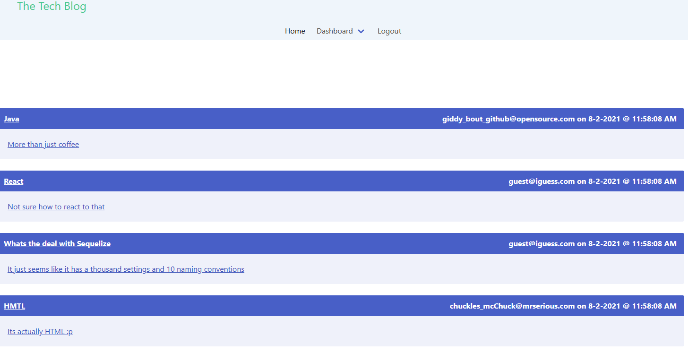

# Tech Blog

### Description

Share your thoughts on the Tech Blog!

CMS-style blog site similar to a Wordpress site, where developers can publish their blog posts and comment on other developers’ posts as well.
Modularized application following the Model-View-Controller (MVC) paradigm.

### Table of Contents

- [Usage Guide](#Usage-Guide)
- [Install Instructions](#Installation)
- [Technologies Used](#Technologies-Used)
- [Contributions](#Contributions)
- [Tests](#Tests)
- [Questions](#Questions)

## Usage Guide

Deployed on [Heroku](https://brasstech.herokuapp.com/) This application demonstrates database management functions and both front and back end development. Also introducing handlebars for templates!

Get started on the Tech Blog [here](https://brasstech.herokuapp.com/)

## Technologies Used

Sequelize, Node, MySQL2, expresss-handlebars, bcrypt, express-session, dotENV

## Contributions

This is currently my own work. Please feel free to submit your contributions on GITHUB with credits given

## Tests

Future testing planned using Jest testing framework

## Questions

If you have any questions or want to keep up with my latest projects, please follow me on [Github](http://www.github.com/operationBrass) or contact me via [Email](mr.brn.lewis@outlook.com).
